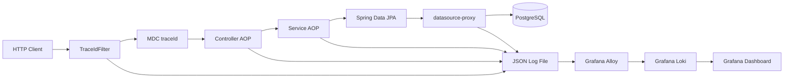

# Architecture

## 전체 요청 흐름



요청 진입부터 JDBC 실행 완료까지 동일한 `traceId`가 JSON 로그 필드에 남는다. Alloy는 로그 파일을 수집하고 낮은 cardinality 필드만 Loki Label로 승격한다. Grafana는 Loki 로그를 JSON으로 파싱해 요청 흐름과 지연을 조회한다.

## 구성요소와 책임

| 구성요소 | 책임 | 주요 이벤트 |
| --- | --- | --- |
| `TraceIdFilter` | traceId 검증·생성, MDC 설정·정리, 응답 헤더, 전체 HTTP 시간 | `REQUEST_START`, `REQUEST_END`, `SLOW_REQUEST` |
| Controller AOP | Controller 메서드 실행시간 | `CONTROLLER_END` |
| Service AOP | Service 메서드 실행시간과 Slow 판별 | `SERVICE_END`, `SLOW_SERVICE` |
| `datasource-proxy` | 실제 JDBC 실행 완료 시간과 성공 여부 | `SQL_EXECUTION`, `SLOW_SQL` |
| Async Demo | MDC 미전파와 `TaskDecorator` 전파 비교 | 응답의 caller/worker traceId |
| JSON Log + Alloy | 구조화 로그 파일 수집과 Loki 전송 | JSON fields + 고정 Label |
| Loki + Grafana | 로그 저장, LogQL 조회, Troubleshooting 화면 | 요청·오류·지연·trace flow |

## Filter와 AOP 역할 차이

Servlet Filter는 Controller 진입 전부터 응답 완료까지 HTTP 요청의 생명주기를 감싼다. 따라서 traceId를 결정하고 MDC에 넣는 위치이며, 반드시 `finally`에서 제거해 재사용되는 Servlet Thread로 값이 누수되지 않게 한다. 응답의 `X-Trace-Id`도 Filter가 설정한다.

AOP는 traceId를 만들지 않는다. 이미 Filter가 만든 컨텍스트를 이용해 지정된 Controller와 Service 패키지의 실행시간만 측정한다. Pointcut을 좁혀 프레임워크 내부나 Repository 전체에 불필요하게 적용하지 않는다.

## MDC와 Async

MDC는 현재 Thread에 연결된 진단 컨텍스트다. Servlet Thread의 `traceId`는 별도 Thread Pool의 Worker로 자동 복사되지 않는다.

```text
전파 없음: Servlet Thread(traceId) → Worker Thread(traceId 없음)
TaskDecorator: Servlet Thread(traceId) → context copy → Worker Thread(같은 traceId)
                                                   → finally restore/clear
```

프로젝트는 두 Executor를 모두 제공한다. 전파 Executor의 `TaskDecorator`는 제출 시점의 MDC map을 복사하고 Worker 실행 전 설정한다. 실행이 끝나면 Worker가 이전에 보유한 context를 복원하거나 제거한다. 이 정리가 없으면 Pool Thread의 다음 작업에 이전 요청 값이 남을 수 있다.

## datasource-proxy를 선택한 이유

Hibernate `StatementInspector`는 SQL이 JDBC로 실행되기 전에 SQL 문자열을 검사하거나 바꾸는 확장점이다. 실행 완료 시점을 감싸지 않으므로 실제 DB 왕복 시간을 재는 용도로 쓰지 않았다.

`datasource-proxy`는 애플리케이션 DataSource를 감싸 JDBC query 실행 전후를 관찰한다. 이 프로젝트는 여기서 `elapsedMs`, 성공 여부, 예외, SQL operation을 기록하고 설정된 threshold와 비교한다. Bind Parameter는 기본 로그에 남기지 않고 SQL 문자열은 공백을 정규화한 뒤 2,000자로 제한한다.

## 로그 구조와 Loki Label

애플리케이션 로그는 JSON Lines로 파일에 기록한다. 주요 필드는 다음과 같다.

- 공통: `timestamp`, `level`, `application`, `environment`, `logger`, `thread`, `traceId`
- 실행 구간: `layer`, `event`, `class`, `method`, `elapsedMs`, `slow`
- HTTP: `httpMethod`, `uri`, `status`
- SQL: `sqlOperation`, `sql`, `success`, `exception`

Loki 저장 Label은 `application`, `environment`, `level`만 사용한다. `traceId`, URI, SQL처럼 요청마다 변하는 값은 Label 수를 급격하게 늘리는 high-cardinality 데이터이므로 JSON field로 유지하고 LogQL의 `| json`으로 검색한다.

## Docker Stack

| Service | 역할 | 기본 포트 |
| --- | --- | --- |
| `app` | Spring Boot API와 JSON 로그 생성 | 8080 |
| `postgres` | Order와 Slow SQL 실험 DB | 5432 |
| `alloy` | JSON 로그 파일 수집 | 12345 |
| `loki` | 로그 저장·LogQL API | 3100 |
| `grafana` | Provisioned Dashboard | 3000 |

Prometheus, OpenTelemetry, Tempo, Jaeger는 포함하지 않는다. 이 Lab의 관측 데이터 원천은 Loki에 저장된 애플리케이션 로그 하나다.
