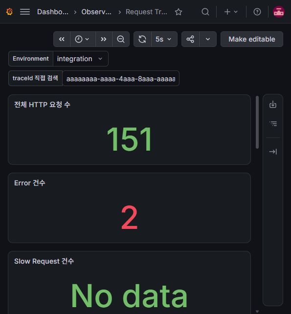
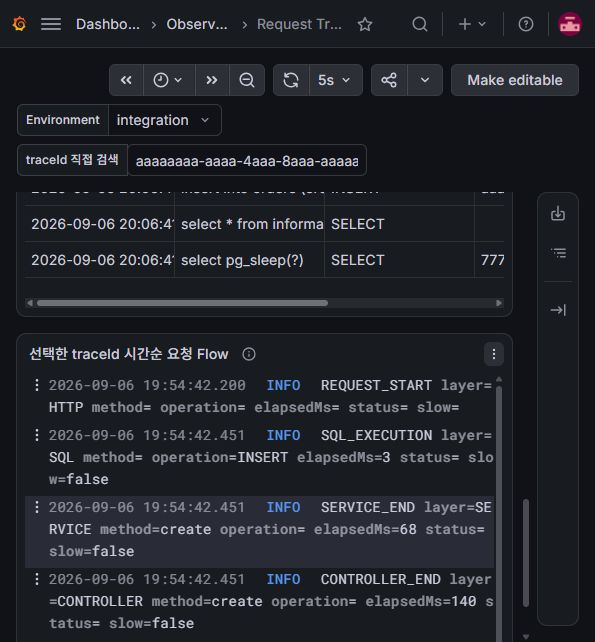

# Measured Results

아래 값은 2026-09-06 Windows 11, Java 21.0.8, Docker Engine 24.0.7, Docker Compose 2.23.3 환경에서 직접 실행한 결과다. 실행하지 않은 수치나 추정값은 포함하지 않았다.

## 자동 검증

| Phase | 검증 범위 | 실제 결과 |
| --- | --- | --- |
| 1 | Order CRUD + 실제 PostgreSQL | 6 tests PASS |
| 2 | traceId 생성·재사용·교체·응답·MDC 정리 | 12 tests PASS |
| 3 | Controller/Service AOP와 Slow 판별 | 15 tests PASS |
| 4 | JDBC SQL 시간과 Slow SQL | 20 tests PASS |
| 5 | Async MDC 전파·미전파·Worker 정리 | 24 tests PASS |
| 6-7 | JSON 로그, Error, 전체 회귀 | 25 tests PASS |

Phase 7 최종 `clean build`는 `BUILD SUCCESSFUL`, 전체 25 tests, failures 0이었다. 통합 테스트는 Testcontainers의 실제 PostgreSQL을 사용했다.

## Scenario A - 정상 요청

- traceId: `aaaaaaaa-aaaa-4aaa-8aaa-aaaaaaaaaaaa`
- HTTP: `201`
- 실제 Flow: `REQUEST_START → SQL_EXECUTION → SERVICE_END → CONTROLLER_END → REQUEST_END`
- SQL: 3ms
- Service: 68ms
- Controller: 140ms
- HTTP 전체: 188ms
- `slow`: false

## Scenario B - Slow Service / Slow Request

- traceId: `9c644e13-f47b-4b8a-b3f5-a265f1a36d5f`
- Service: 713ms, `SLOW_SERVICE`, `slow=true`
- Controller: 745ms
- HTTP 전체: 757ms, `SLOW_REQUEST`, `slow=true`
- HTTP: `200`

## Scenario C - Slow SQL

- traceId: `77777777-7777-4777-8777-777777777777`
- `SQL_EXECUTION`: 301ms
- `SLOW_SQL`: 301ms, `slow=true`
- HTTP: `200`

Phase 4의 별도 검증에서는 traceId `a907d75e-cd37-4330-a338-97da1e1ed5e2`로 SQL 302ms, Service 323ms, HTTP 392ms를 측정했다. SQL만 200ms threshold를 초과했고 Service/HTTP는 500ms threshold 이하였다.

## Scenario D - Error

- traceId: `88888888-8888-4888-8888-888888888888`
- HTTP: `500`
- event: `APPLICATION_ERROR`
- exception: `IntentionalDemoException`
- Error 전후 로그에서 같은 traceId 확인

## Scenario E - Async MDC

| 실행 방식 | caller traceId | worker traceId | Worker Thread |
| --- | --- | --- | --- |
| 전파 없음 | `11111111-1111-4111-8111-111111111111` | `null` | `async-no-mdc-1` |
| `TaskDecorator` | `22222222-2222-4222-8222-222222222222` | caller와 동일 | `async-mdc-1` |

자동 테스트로 각 Worker의 다음 작업에서 이전 MDC가 남지 않는 것도 확인했다.

## Loki와 Grafana

- Compose 서비스 `app`, `postgres`, `alloy`, `loki`, `grafana`: 모두 running (`app`, `postgres`는 healthcheck `healthy`)
- Loki ingest/query: PASS
- 저장 Label: `application`, `environment`, `level`
- `traceId` Label: 없음
- JSON의 `environment` 필드 수: 1
- Grafana Loki datasource health: `OK`
- Dashboard folder/uid: `Observability Lab` / `request-trace-troubleshooting`
- Dashboard panel: 8개
- 변수: `application`, `environment`, `traceId`
- 실제 실행한 Dashboard LogQL 6개: 모두 Loki API 문법/실행 성공

대시보드 화면 캡처 시점에는 전체 HTTP 요청 151건, Error 2건이 표시됐다. 전체 요청에는 Compose의 주기적인 `/actuator/health` 호출이 포함된다. 같은 30분 구간에 Slow Request가 없어 해당 Stat은 `No data`였고, 이는 Phase 7 Loki API 조회의 Slow Request 0 series와 일치했다.

두 번째 화면은 traceId `aaaaaaaa-aaaa-4aaa-8aaa-aaaaaaaaaaaa`를 선택해 `REQUEST_START`, `SQL_EXECUTION`, `SERVICE_END`, `CONTROLLER_END`, `REQUEST_END`를 시간순으로 조회한 실제 결과다.

Phase별 명령, 실패 후 재실행 사실, 세부 traceId와 수치는 [`PROGRESS.md`](../PROGRESS.md)에 기록돼 있다.
